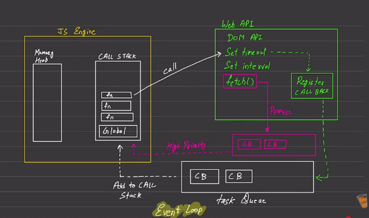

# 📌 Is JavaScript Synchronous or Asynchronous ?

👉 JavaScript is **Single Threaded**  
👉 JavaScript is **Synchronous by default**

Meaning:

- JS runs one line at a time
- Uses one Call Stack
- Cannot execute multiple pieces of JS code simultaneously

---

## 📌 What Does "Synchronous" Mean ?
👉 Code runs line-by-line  
👉 Next line waits until previous line finishes  

### Example:
```js
console.log("A");
console.log("B");
console.log("C");
```

### Output:
```
A
B
C
```
JS will NEVER skip order in synchronous execution.

---

## 📌 Problem With Pure Synchronous JS
If one task is slow:
- Network request
- File reading
- Timer
- Database call

👉 Entire program would freeze / block UI

### Example:
```js
fetchDataFromServer(); // takes 5 seconds
console.log("Hello");
```

Without async behavior:

```
Hello would wait 5 seconds ❌
```

---

## 📌 What Makes JavaScript Asynchronous ?

JS engine alone is synchronous.

👉 Asynchronous behavior is provided by:

- ✔ Web APIs (Browser / Node APIs)
- ✔ Callback Queue / Task Queue
- ✔ Microtask Queue (Promises)
- ✔ Event Loop

---


# 📌 Breaking Down Your Diagram




## 🟨 JS Engine

Contains:

### ✔ Memory Heap

- Stores objects
- Stores arrays
- Stores functions
- Stores data

---

### ✔ Call Stack (we already know)

---

## 📌 Web APIs (Green Box in Diagram)

These are provided by browser / runtime environment.

They handle:

- setTimeout
- setInterval
- fetch
- DOM events

👉 JS engine sends async tasks here.

---

## 📌 How Async Actually Happens

### Example:

```js
setTimeout(() => console.log("Timer"), 2000);
console.log("Hello");
```

---

### Step 1 → Call Stack

```
Global()
setTimeout()
```

JS sees `setTimeout` → sends it to Web API

---

### Step 2 → Web API

Timer starts running outside JS engine. (in the Register Callback box)

Meanwhile:

```js
console.log("Hello")
```

Runs immediately.

---

### Step 3 → After Timer Finishes

Callback moves to:
```
Task Queue (Callback Queue)
```

i.e., after time is finished , callback is registered to the Task Queue.

---

## 📌 Task Queue (Bottom White Box in Diagram)
- Stores callbacks from:
	- setTimeout
	- setInterval
	- DOM events

---

## 📌 Microtask Queue (Pink Box in Diagram)
- Higher priority queue.

- Stores callbacks from:
	- Promises
	- MutationObserver
	- queueMicrotask

👉 Runs BEFORE Task Queue

---

## 📌 Event Loop (Brain Of Async JS)
👉 Event loop of JS constantly checks:

```
Is Call Stack empty ?
```

If YES:

1. Run all Microtasks first (Higher Priority Queue)  
2. Then run Task Queue callbacks  

---

## 📌 Event Loop Flow (According To Your Diagram)
```
Call Stack runs code
        ↓
Async tasks sent to Web APIs
        ↓
Web APIs finish work
        ↓
Callbacks sent to queues
        ↓
Event Loop checks stack
        ↓
Moves callbacks into stack
```

---

## 📌 Priority Order (VERY IMPORTANT)
```
1️⃣ Call Stack
2️⃣ Microtask Queue (Promises)
3️⃣ Task Queue (Timers / Events)
```

---

## 📌 Example Showing Priority
```js
setTimeout(() => console.log("Timeout"));

Promise.resolve().then(() => console.log("Promise"));

console.log("Sync");
```

### Output:
```
Sync
Promise
Timeout
```

👉 Because Promise → Microtask → Higher priority

---

Now here, comes the question of which one is Greater : Synchronous code (blocking code) v/s Asynchronous code (non-blocking code).
### Blocking v/s Non-blocking code :
-> Just cause it's non-blocking doesn't mean non-blocking code is the best option always. In reality, both has its own usecases.
-> In node there are functions involving blocking and non-blocking code (readFileSync vs readFileAsync).

**Use Cases** :
- If u have a large file, u want to write to DB, and u dont want the code to stop working, u use Asynchronous.
- But what if u want to register a user, is it good to make it asynchronous ? 
	- async case : user will register, synchronous register page will show "registration successful" , and wont catch if any error's happen in Db.
	-> Hence, u want synchronous code for cases like this.
	- sync case : user will register, will have to wait, if any db error happens, that is shown to the user. and if it succeeds, then "registration successful".


