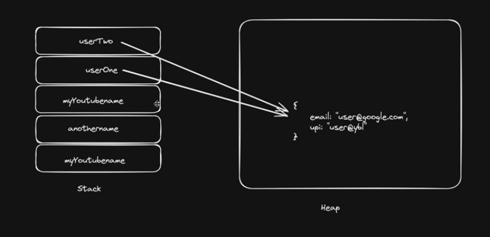

# 📦 Data Types and Memory in JavaScript

## 🔹 Data Types

### ✅ Primitive Data Types
- `null`
- `undefined`
- `Number`
- `String`
- `BigInt`
- `Symbol`

---

### ✅ Non-Primitive Data Types
- `Array`
- `Object`

---

# 🧠 Stack Memory vs Heap Memory

## 📌 Stack Memory

- Primitive data types are stored in **stack memory**.
- In stack memory, **a copy is created** whenever a value is assigned to another variable.

### Example

```js
let myYoutubeName = "kennychannel";
let anotherName = myYoutubeName;

anotherName = "notkennychannel";

console.log(myYoutubeName); // kennychannel
console.log(anotherName); // notkennychannel
```

👉 No changes were made to `myYoutubeName`,  
because a separate copy of it was assigned to `anotherName`.

---

## 📌 Heap Memory

- Non-primitive data types like **objects, arrays, etc.** are stored in **heap memory**.
- Whenever they are assigned to a variable, **a reference is passed** to it.

**Meaning**:
- Making changes to the variable also reflects changes in the original data.

### Example

```js
let userOne = {
  name: "kenny",
  upi: "kenny@upi",
};

let userTwo = userOne;
userTwo.name = "manny";

console.log(userOne);
console.log(userTwo);
```

### ❓ Question
Will `userOne.name` be `kenny` or `manny`?
👉 It will be **`manny`**

Because:
- A reference of `userOne` was passed to `userTwo`
- So when changes are made to `userTwo`, they are actually being made to `userOne` (the original copy)

---

# 🖼️ Stack vs Heap Diagram




