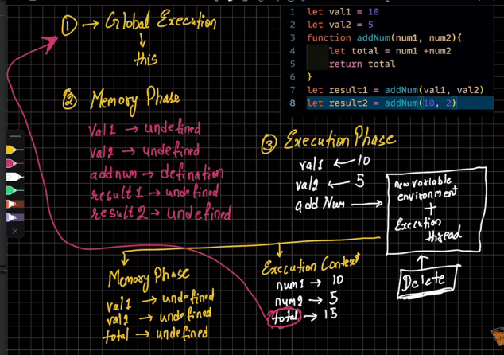

There are two main execution contexts for functions running in JS:

- Global Execution Context
- Function Execution Context
- In some documentations of mongoose, you may also see reference of a separate lesser-known execution context, **Eval Execution Context**

---

## How does code run in JS?

👉 There are two phases for code to run in JavaScript:

1. Memory Creation Phase  
2. Execution Phase  

---

### 🧠 Memory Creation Phase

In the memory creation phase:

- Memory is allocated for every variable and function definition in code.
- Variables contain `undefined` values.
- Functions store their `definitions`.

---

### ⚙️ Execution Phase

In the execution phase:

- Variables are assigned their actual values.
- Functions are executed.
- Function calls are pushed onto the **Call Stack**.

#### Example Flow

- When **one of the functions is called**, a stack for function `a()` is pushed onto the Call Stack.
- It gets popped when program flow reaches the ending curly braces `}` of `function a()`.

---

### 📌 Function Execution Context Details

Each function execution context has:

- A **New Variable Environment**
- An **Execution Thread**

Similarly, each function context has its own:

1. Memory Creation Phase  
2. Execution Phase  

---

### 📌 Return Values in Call Stack

- In the **Call Stack**, the return value of each function (or function context) is passed to the function right below it.

- This is important when dealing with **nested functions**, where functions are stacked upon functions, which are stacked upon the Global Execution Context (G.E.C).

